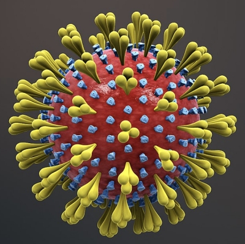
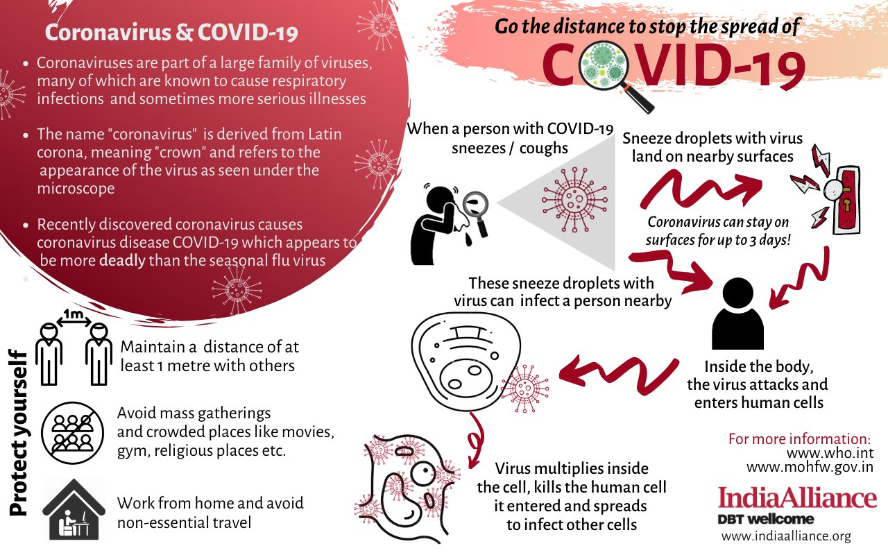
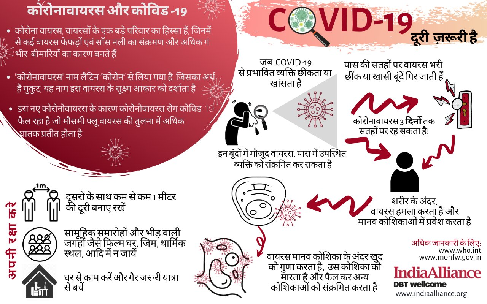
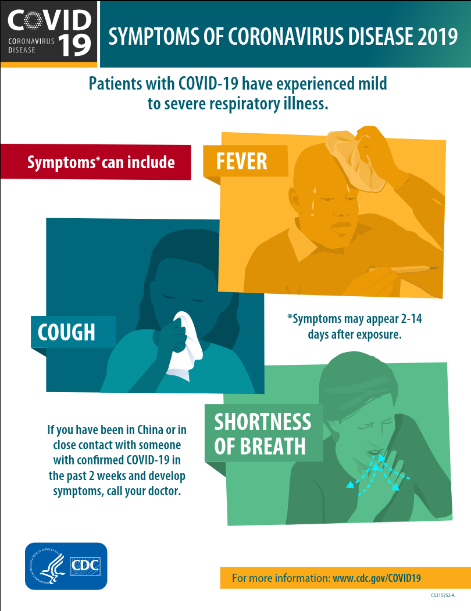
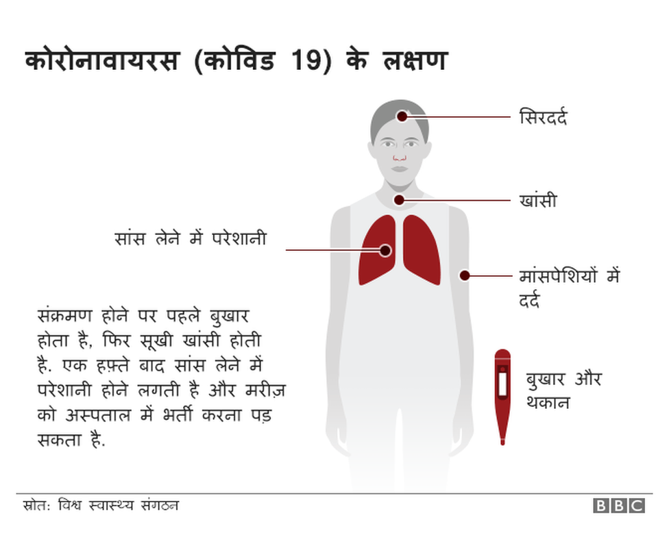
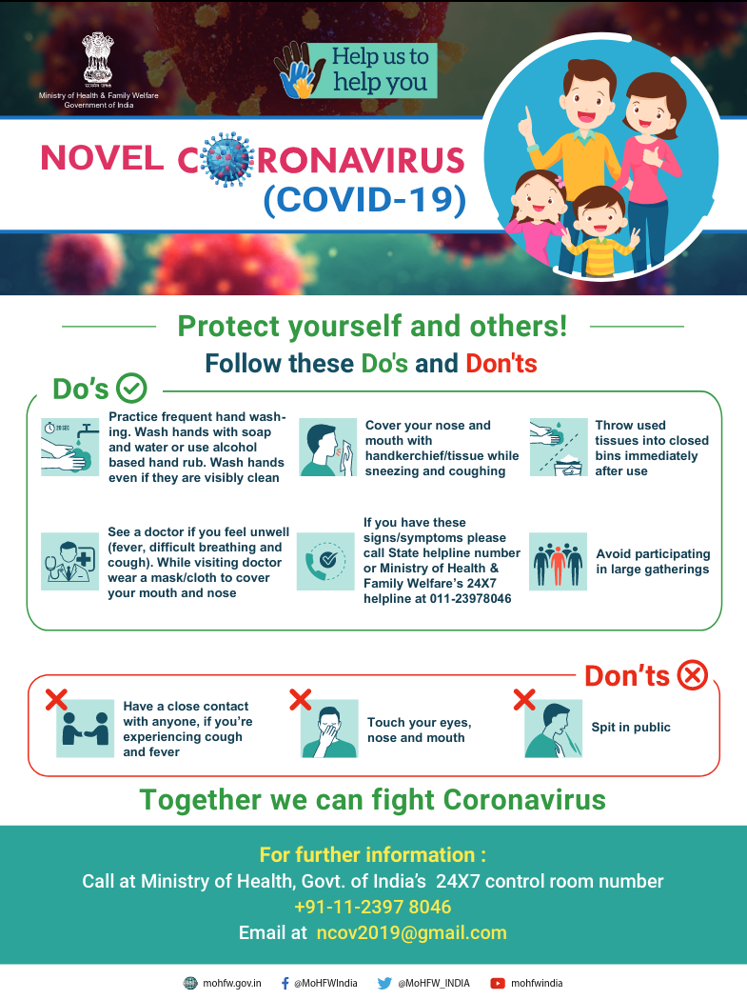
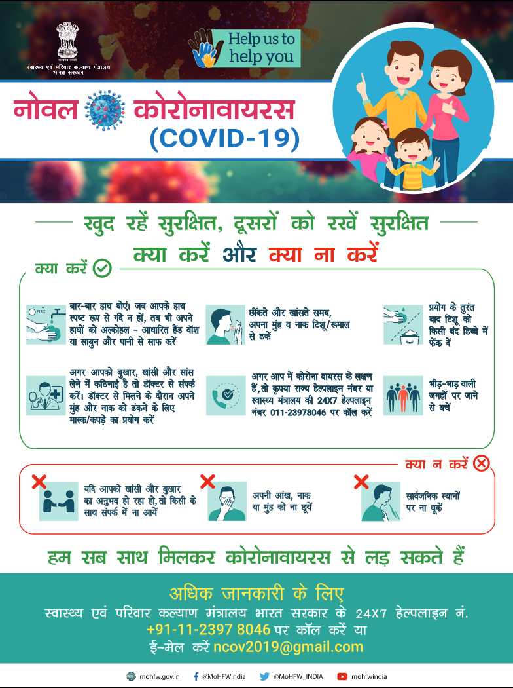
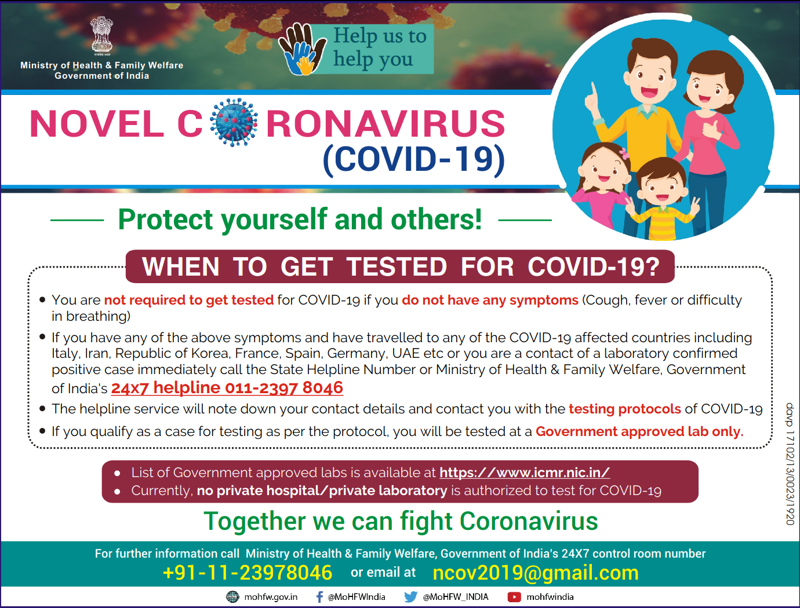
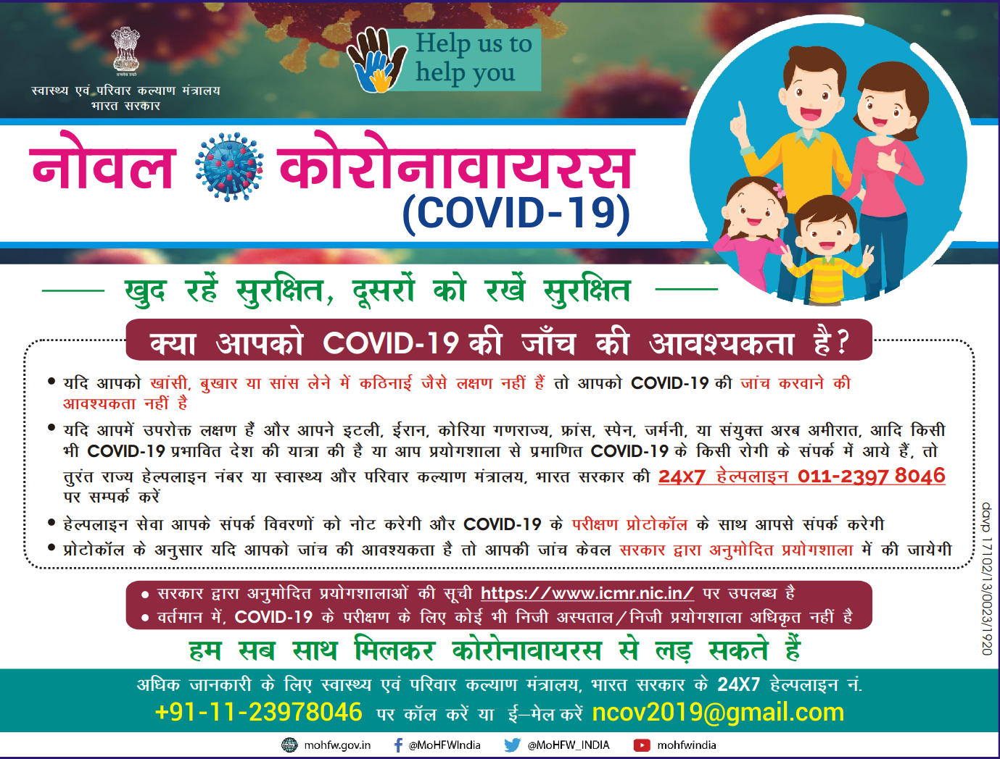

# CORONAVIRUS

   

Refer to [ Ministry of Health and Family Welfare - GOI](https://www.mohfw.gov.in/) for live update.  
लाइव अपडेट के लिए [स्वास्थ्य और परिवार कल्याण मंत्रालय - भारत सरकार](https://www.mohfw.gov.in/) पर जाएं।

## What are Coronaviruses? | Coronaviruses क्या है? 

Coronaviruses (CoV) are a large family of viruses that cause illness ranging from the common cold to more severe diseases such as Middle East Respiratory Syndrome (MERS-CoV) and Severe Acute Respiratory Syndrome (SARS-CoV).  

Coronaviruses (CoV) वायरस के एक बड़े परिवार के हैं जो सामान्य सर्दी से लेकर गंभीर बीमारियों जैसे मध्य पूर्व श्वसन सिंड्रोम (MERS-CoV) और गंभीर एक्यूट रेस्पिरेटरी सिंड्रोम (SARS-CoV) का कारण बनता है।

## What is COVID-19? | COVID-19 क्या है?

COVID-19 is the infectious disease caused by the most recently discovered coronavirus. This new virus and disease were unknown before the outbreak began in Wuhan, China, in December 2019.   

COVID-19 सबसे हाल ही में खोजे गए कोरोनावायरस के कारण होने वाला संक्रामक रोग है। यह नया वायरस और बीमारी दिसंबर 2019 में चीन के वुहान में फैलने से पहले अज्ञात थी।

## How does COVID-19 spread? | COVID-19 कैसे फैलता है?

People can catch COVID-19 from others who have the virus. The disease can spread from person to person through small droplets from the nose or mouth which are spread when a person with COVID-19 coughs or exhales. These droplets land on objects and surfaces around the person. Other people then catch COVID-19 by touching these objects or surfaces, then touching their eyes, nose or mouth. People can also catch COVID-19 if they breathe in droplets from a person with COVID-19 who coughs out or exhales droplets. This is why it is important to stay more than 1 meter (3 feet) away from a person who is sick. 

लोग वायरस वाले अन्य लोगों से COVID -19 पकड़ सकते हैं। यह बीमारी नाक या मुंह से छोटी बूंदों के माध्यम से एक व्यक्ति से दूसरे व्यक्ति में फैल सकती है, जो तब फैलती है जब सीओवीआईडी -19 से पीड़ित व्यक्ति खांसी या सांस छोड़ता है। ये बूंदें व्यक्ति के आसपास की वस्तुओं और सतहों पर उतरती हैं। अन्य लोग तब इन वस्तुओं या सतहों को छूकर, फिर अपनी आंखों, नाक या मुंह को छूकर COVID -19 से संक्रमित हो जाते हैं। सीओवीआईडी -19 से लोग तब भी संक्रमित हो सकते हैं, जब वे सीओवीआईडी -19 वाले व्यक्ति से बूंदों में सांस लेते हैं जो खांसी करते हैं या बूंदों को बाहर निकालते हैं। यही कारण है कि बीमार रहने वाले व्यक्ति से 1 मीटर (3 फीट) से अधिक रहना महत्वपूर्ण है।

  

## What are the symptoms of COVID-19? | COVID-19 के लक्षण क्या हैं?

People may experience:

- Fever
- Tiredness
- Dry Cough
- Running nose
- Sore throat
- Diarrhea
- Difficulty breathing (severe cases)

लोग अनुभव कर सकते हैं:

- बुखार
- थकान
- सूखी खाँसी
- बहता नाक
- गले में खरास
- दस्त
- सांस लेने में कठिनाई (गंभीर मामले)

 &nbsp;&nbsp;&nbsp; 

## Basic protective measures | बुनियादी सुरक्षात्मक उपाय

### Wash your hands frequently | बार-बार हाथ धोएं

Regularly and thoroughly clean your hands with an alcohol-based hand rub or wash them with soap and water.  
अपने हाथों को अल्कोहल-आधारित हाथ रगड़ से नियमित रूप से और अच्छी तरह से साफ करें या उन्हें साबुन और पानी से धोएं।

**Why?** Washing your hands with soap and water or using alcohol-based hand rub kills viruses that may be on your hands.   
**क्यों?** अपने हाथों को साबुन और पानी से धोना या अल्कोहल-आधारित हाथ रगड़ का उपयोग करना उन वायरस को मारता है जो आपके हाथों पर हो सकते हैं।

### Maintain social distancing  | सामाजिक दूरियां बनाए रखें

Maintain at least 1 metre (3 feet) distance between yourself and anyone who is coughing or sneezing.  
कम से कम 1 मीटर (3 फीट) की दूरी पर अपने आप को और किसी को भी, जो खांस रहा है या छींक रहा है, के बीच दूरी बनाए रखें। 

**Why?** When someone coughs or sneezes they spray small liquid droplets from their nose or mouth which may contain virus. If you are too close, you can breathe in the droplets, including the COVID-19 virus if the person coughing has the disease.   
**क्यों?** जब किसी को खांसी या छींक आती है तो वे अपनी नाक या मुंह से छोटी तरल बूंदें छिड़कते हैं जिनमें वायरस हो सकता है। यदि आप बहुत करीब हैं, तो आप खांसी में सांस ले सकते हैं, जिसमें सीओवीआईडी -19 वायरस भी शामिल है यदि खांसी करने वाले व्यक्ति को यह बीमारी है।  

  &nbsp;&nbsp;&nbsp;&nbsp;    

### Avoid touching eyes, nose and mouth | आंख, नाक और मुंह छूने से बचें

**Why?** Hands touch many surfaces and can pick up viruses. Once contaminated, hands can transfer the virus to your eyes, nose or mouth. From there, the virus can enter your body and can make you sick.    
**क्यों?** हाथ कई सतहों को छूते हैं और वायरस उठा सकते हैं। एक बार दूषित होने पर, हाथ वायरस को आपकी आंखों, नाक या मुंह में स्थानांतरित कर सकते हैं। वहां से, वायरस आपके शरीर में प्रवेश कर सकता है और आपको बीमार कर सकता है।

### Practice respiratory hygiene | श्वसन स्वच्छता का अभ्यास करें

Make sure you, and the people around you, follow good respiratory hygiene. This means covering your mouth and nose with your bent elbow or tissue when you cough or sneeze. Then dispose of the used tissue immediately.  
सुनिश्चित करें कि आप, और आपके आस-पास के लोग, अच्छी श्वसन स्वच्छता का पालन करें। इसका मतलब है खांसी या छींक आने पर अपनी मुड़ी हुई कोहनी या ऊतक से अपने मुंह और नाक को ढंकना। फिर इस्तेमाल किए गए ऊतक का तुरंत निपटान करें।

**Why?** Droplets spread virus. By following good respiratory hygiene you protect the people around you from viruses such as cold, flu and COVID-19.    
**क्यों?** छींक की बूंदें वायरस फैलाती हैं। अच्छी श्वसन स्वच्छता का पालन करके आप अपने आसपास के लोगों को सर्दी, फ्लू और सीओवीआईडी ​​-19 जैसे वायरस से बचाते हैं।

### If you have fever, cough and difficulty breathing, seek medical care early | अगर आपको बुखार, खांसी और सांस लेने में कठिनाई हो रही है, तो जल्द चिकित्सा सेवा लें

Stay home if you feel unwell. If you have a fever, cough and difficulty breathing, seek medical attention and call in advance. Follow the directions of your local health authority.  
यदि आप अस्वस्थ महसूस करते हैं तो घर पर रहें। यदि आपको बुखार, खांसी और सांस लेने में कठिनाई है, तो चिकित्सा पर ध्यान दें और पहले से फोन करें। अपने स्थानीय स्वास्थ्य प्राधिकरण के निर्देशों का पालन करें।

**Why?** National and local authorities will have the most up to date information on the situation in your area. Calling in advance will allow your health care provider to quickly direct you to the right health facility. This will also protect you and help prevent spread of viruses and other infections.    
**क्यों?** राष्ट्रीय और स्थानीय अधिकारियों के पास आपके क्षेत्र की स्थिति के बारे में सबसे अधिक जानकारी होगी। अग्रिम में कॉल करने से आपका स्वास्थ्य देखभाल प्रदाता आपको जल्दी से सही स्वास्थ्य सुविधा के लिए निर्देशित कर सकेगा। यह आपकी रक्षा भी करेगा और वायरस और अन्य संक्रमणों को फैलने से रोकने में मदद करेगा।

### Stay informed and follow advice given by your healthcare provider | सूचित रहें और अपने स्वास्थ्य सेवा प्रदाता द्वारा दी गई सलाह का पालन करें

Stay informed on the latest developments about COVID-19. Follow advice given by your healthcare provider, your national and local public health authority or your employer on how to protect yourself and others from COVID-19.  
COVID-19 के बारे में नवीनतम घटनाओं से अवगत रहें। अपने स्वास्थ्य सेवा प्रदाता, अपने राष्ट्रीय और स्थानीय सार्वजनिक स्वास्थ्य प्राधिकरण या अपने नियोक्ता द्वारा COVID -19 से खुद को और दूसरों की रक्षा करने के लिए दी गई सलाह का पालन करें।

**Why?** National and local authorities will have the most up to date information on whether COVID-19 is spreading in your area. They are best placed to advise on what people in your area should be doing to protect themselves.   
**क्यों?** राष्ट्रीय और स्थानीय अधिकारियों के पास इस बात की सबसे अधिक जानकारी होगी कि आपके क्षेत्र में सीओवीआईडी ​​-19 फैल रहा है या नहीं। उन्हें इस बात की सलाह देने के लिए सर्वोत्तम स्थान दिया गया है कि आपके क्षेत्र के लोगों को अपनी सुरक्षा के लिए क्या करना चाहिए। 

## When to get tested for COVID-19? | कब COVID-19 के लिए परीक्षण किया जाना है?

   

## Is there a vaccine, drug or treatment for COVID-19? | क्या COVID-19 का टीका, दवा या उपचार है?

Not yet. To date, there is no vaccine and no specific antiviral medicine to prevent or treat COVID-2019. However, those affected should receive care to relieve symptoms. People with serious illness should be hospitalized. Most patients recover thanks to supportive care.   
अभी नहीं। आज तक, COVID-2019 को रोकने या इसका इलाज करने के लिए कोई टीका और कोई विशिष्ट एंटीवायरल दवा नहीं है। हालांकि, प्रभावित लोगों को लक्षणों से राहत पाने के लिए देखभाल करनी चाहिए। गंभीर बीमारी वाले लोगों को अस्पताल में भर्ती होना चाहिए। अधिकांश रोगी सहायक देखभाल के लिए धन्यवाद पुनर्प्राप्त करते हैं।

## Educate Yourself | अपने आप को शिक्षित करें
- [Coronavirus Outbreak in India](https://covidout.in/)  
- [WHO Coronavirus disease (COVID-19) outbreak](https://www.who.int/emergencies/diseases/novel-coronavirus-2019)  
- [Harvard Medical School Coronavirus Resource Center](https://www.health.harvard.edu/diseases-and-conditions/coronavirus-resource-center)
- [Flatten the Curve](https://www.flattenthecurve.com/)
- [JHS Center for Health Security Situation Reports](http://www.centerforhealthsecurity.org/resources/COVID-19/index.html)
- [WHO COVID-19 advice for the public: Myth busters](https://www.who.int/emergencies/diseases/novel-coronavirus-2019/advice-for-public/myth-busters) - Debunking myths about transmission and prevention
- [How to fight the coronavirus SARS-CoV-2 and its disease, CoVID-19](https://drive.google.com/file/d/1DqfSnlaW6N3GBc5YKyBOCGPfdqOsqk1G/view) - Slide deck by Michael Lin, PhD-MD of Stanford's Lin Lab
- [Wikipedia *Coronavirus_disease_2019*](https://en.wikipedia.org/wiki/Coronavirus_disease_2019)

## Watch Corona Virus information videos | कोरोना वायरस जानकारी वीडियो देखें

<iframe width="336" height="189" src="https://www.youtube.com/embed/mOV1aBVYKGA" frameborder="0" allow="accelerometer; autoplay; encrypted-media; gyroscope; picture-in-picture" allowfullscreen></iframe> 

<iframe width="336" height="189" src="https://www.youtube.com/embed/ti5cL0CXkhs" frameborder="0" allow="accelerometer; autoplay; encrypted-media; gyroscope; picture-in-picture" allowfullscreen></iframe>     

<iframe width="336" height="189" src="https://www.youtube.com/embed/K3BqiNq9Xf0" frameborder="0" allow="accelerometer; autoplay; encrypted-media; gyroscope; picture-in-picture" allowfullscreen></iframe>

<iframe width="336" height="189" src="https://www.youtube.com/embed/pvG4OiwoR2U" frameborder="0" allow="accelerometer; autoplay; encrypted-media; gyroscope; picture-in-picture" allowfullscreen></iframe>

## PM Narendra Modi addresses the Nation on issues relating to COVID-19 | COVID-19 से संबंधित मुद्दों पर राष्ट्र को संबोधित करते हुए पीएम नरेंद्र मोदी

<iframe width="560" height="315" src="https://www.youtube.com/embed/5bjrEb6w-Rk" frameborder="0" allow="accelerometer; autoplay; encrypted-media; gyroscope; picture-in-picture" allowfullscreen></iframe>

## Researches About COVID-19 in INDIA | भारत में COVID-19 के बारे में शोध
- [INDIA COVID-19 Open Research, Data & Resources](http://vinodscaria.rnabiology.org/covid-19/)
- [CoronaActionIndia](https://tavlab-iiitd.github.io/CoronaActionIndia/)
- [ICMR COVID-19](https://icmr.nic.in/content/covid-19)

## COVID Test centers in INDIA | भारत में COVID परीक्षण केंद्र
- [COVID -19 Testing Sites](https://icmr.nic.in/sites/default/files/upload_documents/COVID_19_Testing_Laboratories.pdf)

<iframe src="https://www.google.com/maps/d/embed?mid=15Kg1GOrvwPN_SozeKJbjNtsvKO7uLqsO" width="640" height="480"></iframe>

## References & sources | संदर्भ और स्रोत:
- [WHO](https://www.who.int/)
- [MOHFW-GOI](https://www.mohfw.gov.in/)
- [BBC](https://www.bbc.com/)
- [ICMR](https://www.icmr.nic.in/content/covid-19)
- [CSIR-IGIB](http://vinodscaria.rnabiology.org/covid-19/)

--- 
> This page is maintained by [Anurag Raj](https://anuragraj.github.io/). You can give your suggestions to improve this webpage.   
> यह पृष्ठ [अनुराग राज](https://anuragraj.github.io/) द्वारा बनाया गया है। वेबपेज को बेहतर बनाने के लिए आप अपने सुझाव दे सकते हैं।
--- 
> Last Updated: 21st March 2020
